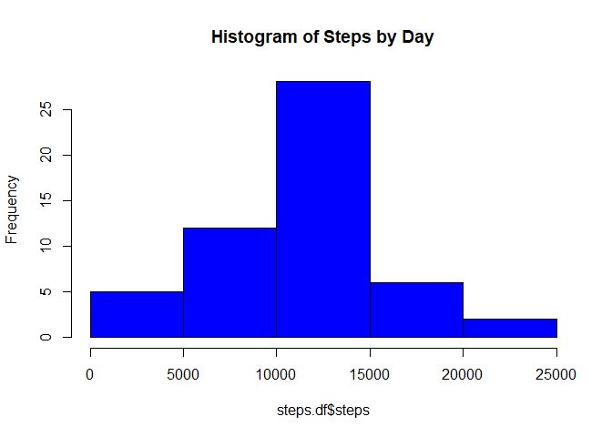
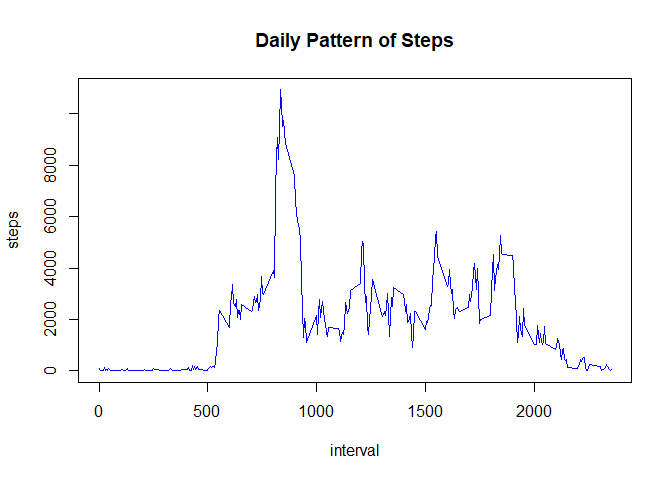
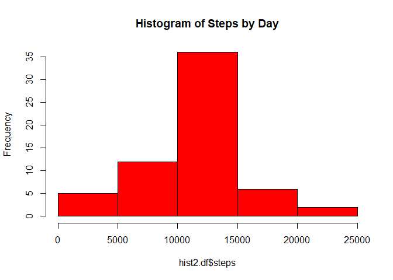
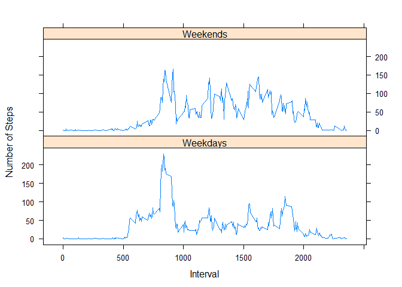

## Loading and preprocessing the data


```r
df <- read.csv("activity.csv", header= TRUE, stringsAsFactors = FALSE)
names(df)
```

```
## [1] "steps"    "date"     "interval"
```

```r
str(df)
```

```
## 'data.frame':	17568 obs. of  3 variables:
##  $ steps   : int  NA NA NA NA NA NA NA NA NA NA ...
##  $ date    : chr  "2012-10-01" "2012-10-01" "2012-10-01" "2012-10-01" ...
##  $ interval: int  0 5 10 15 20 25 30 35 40 45 ...
```

```r
head(df)
```

```
##   steps       date interval
## 1    NA 2012-10-01        0
## 2    NA 2012-10-01        5
## 3    NA 2012-10-01       10
## 4    NA 2012-10-01       15
## 5    NA 2012-10-01       20
## 6    NA 2012-10-01       25
```

```r
dim(df)
```

```
## [1] 17568     3
```

```r
summary(df)
```

```
##      steps            date              interval     
##  Min.   :  0.00   Length:17568       Min.   :   0.0  
##  1st Qu.:  0.00   Class :character   1st Qu.: 588.8  
##  Median :  0.00   Mode  :character   Median :1177.5  
##  Mean   : 37.38                      Mean   :1177.5  
##  3rd Qu.: 12.00                      3rd Qu.:1766.2  
##  Max.   :806.00                      Max.   :2355.0  
##  NA's   :2304
```

```r
table(df$date)
```

```
## 
## 2012-10-01 2012-10-02 2012-10-03 2012-10-04 2012-10-05 2012-10-06 2012-10-07 
##        288        288        288        288        288        288        288 
## 2012-10-08 2012-10-09 2012-10-10 2012-10-11 2012-10-12 2012-10-13 2012-10-14 
##        288        288        288        288        288        288        288 
## 2012-10-15 2012-10-16 2012-10-17 2012-10-18 2012-10-19 2012-10-20 2012-10-21 
##        288        288        288        288        288        288        288 
## 2012-10-22 2012-10-23 2012-10-24 2012-10-25 2012-10-26 2012-10-27 2012-10-28 
##        288        288        288        288        288        288        288 
## 2012-10-29 2012-10-30 2012-10-31 2012-11-01 2012-11-02 2012-11-03 2012-11-04 
##        288        288        288        288        288        288        288 
## 2012-11-05 2012-11-06 2012-11-07 2012-11-08 2012-11-09 2012-11-10 2012-11-11 
##        288        288        288        288        288        288        288 
## 2012-11-12 2012-11-13 2012-11-14 2012-11-15 2012-11-16 2012-11-17 2012-11-18 
##        288        288        288        288        288        288        288 
## 2012-11-19 2012-11-20 2012-11-21 2012-11-22 2012-11-23 2012-11-24 2012-11-25 
##        288        288        288        288        288        288        288 
## 2012-11-26 2012-11-27 2012-11-28 2012-11-29 2012-11-30 
##        288        288        288        288        288
```


## What is mean total number of steps taken per day?


```r
library(dplyr)
```

```
## 
## Attaching package: 'dplyr'
```

```
## The following objects are masked from 'package:stats':
## 
##     filter, lag
```

```
## The following objects are masked from 'package:base':
## 
##     intersect, setdiff, setequal, union
```

```r
steps.df <- df %>% select(1:2) %>% group_by(date) %>% summarize("steps" = sum(steps))
```

```
## `summarise()` ungrouping output (override with `.groups` argument)
```

```r
steps.df <- steps.df[!is.na(as.character(steps.df$steps)),]
steps <- summary(steps.df$steps)
```
Steps per day:


```r
steps.df
```

```
## # A tibble: 53 x 2
##    date       steps
##    <chr>      <int>
##  1 2012-10-02   126
##  2 2012-10-03 11352
##  3 2012-10-04 12116
##  4 2012-10-05 13294
##  5 2012-10-06 15420
##  6 2012-10-07 11015
##  7 2012-10-09 12811
##  8 2012-10-10  9900
##  9 2012-10-11 10304
## 10 2012-10-12 17382
## # ... with 43 more rows
```

Histogram of steps by day:


```r
hist(steps.df$steps, col="blue", main = "Histogram of Steps by Day")
```

<!-- -->


* The mean total number of steps taken per day is 1.0766189\times 10^{4}.
* The median total number of steps taken per day is 1.0765\times 10^{4}.


## What is the average daily activity pattern?


```r
df.no.na <- df[!is.na(as.character(df$steps)),]
i.df <- df.no.na %>% select(1,3) %>% group_by(interval) %>% summarize("steps" = sum(steps))
```

```
## `summarise()` ungrouping output (override with `.groups` argument)
```

```r
plot(i.df, type="l", col="blue", main = "Daily Pattern of Steps")
```

<!-- -->


```r
max.steps.df <- i.df %>% filter(steps == max(steps))
max.interval <- max.steps.df[1,1]
max.steps <- max.steps.df[1,2]
```

The interval with the most steps is 835 with 10927 steps.


## Imputing missing values


```r
df.no.na <- df[!is.na(as.character(df$steps)),] #df with no NA values
df.all.na <- df[rowSums(is.na(df)) > 0,] #df with all NA values

#df with steps mean by interval 
df.i.mean <- df.no.na %>% select(1,3) %>% 
  group_by(interval) %>% 
  summarize("steps" = mean(steps)) 
```

```
## `summarise()` ungrouping output (override with `.groups` argument)
```

```r
#function I found online to replace NAs with steps-mean
VLookup <- function(this, data, key, value) {
  m <- match(this, data[[key]])
  data[[value]][m]
}

#replace NA with step means by intervals
df.all.na$steps <- VLookup(df.all.na$interval, df.i.mean, "interval", "steps")

#put it all back together and arrange
df.na.treated <- rbind(df.no.na, df.all.na)#combine them back together
df.na.treated <- df.na.treated %>% arrange(date, interval) #arrange by date and interval


missing.values <- length(df.all.na$steps)
```

There are 2304 missing values in the dataset.

The code block above walks through steps to identify and replace NA values:

* Separated full dataset into two dataframes:  one with NA values and one without them
* I created another dataframe containing the mean number of steps by interval number
* Then I replaced that mean values in the dataframe containing NA values
* Then I used rbind to put the dataframes back together and arranged them to they'd be back in order.

The new dataset is: **df.na.treated**.


```r
head(df.na.treated)
```

```
##       steps       date interval
## 1 1.7169811 2012-10-01        0
## 2 0.3396226 2012-10-01        5
## 3 0.1320755 2012-10-01       10
## 4 0.1509434 2012-10-01       15
## 5 0.0754717 2012-10-01       20
## 6 2.0943396 2012-10-01       25
```


New histogram by day:


```r
hist2.df <- df.na.treated %>% select(1:2) %>% group_by(date) %>% summarize("steps" = sum(steps))
```

```
## `summarise()` ungrouping output (override with `.groups` argument)
```

```r
steps2 <- summary(hist2.df$steps)
hist(hist2.df$steps, col="red", main = "Histogram of Steps by Day")
```

<!-- -->

The change is clearer in the distribution using summary():


```r
original <- summary(df$steps)
treated <- summary(df.na.treated$steps)
original
```

```
##    Min. 1st Qu.  Median    Mean 3rd Qu.    Max.    NA's 
##    0.00    0.00    0.00   37.38   12.00  806.00    2304
```

```r
treated
```

```
##    Min. 1st Qu.  Median    Mean 3rd Qu.    Max. 
##    0.00    0.00    0.00   37.38   27.00  806.00
```

There are no more NA values and there were 15 more values added in the 3rd quadrant.


## Are there differences in activity patterns between weekdays and weekends?


```r
#convert to Date object to get weekdays and weekends
df.na.treated$date <- as.Date(df.na.treated$date, "%Y-%m-%d") #convert to date class
df.na.treated$days <- as.factor(weekdays(df.na.treated$date)) #identify day of week
df.na.treated$weekday <- ifelse(!(df.na.treated$day %in% 
                                    c("Saturday","Sunday")), TRUE, FALSE) #is this a weekday?

#Get average steps by interval for weekdays
df.weekdays <- df.na.treated[df.na.treated$weekday,]
df.weekdays.mean <- df.weekdays %>% select(1,3) %>% 
  group_by(interval) %>% 
  summarize("steps" = mean(steps)) #df with steps mean by interval 
```

```
## `summarise()` ungrouping output (override with `.groups` argument)
```

```r
df.weekdays.mean <- as.data.frame(df.weekdays.mean)
df.weekdays.mean <- df.weekdays.mean %>% 
  mutate("Time.of.Week" = rep("Weekdays", nrow(df.weekdays.mean))) %>%
  rename("Interval" = interval, "Average.Steps" = steps)

#Get average steps by interval for weekends
df.weekends <- df.na.treated[!df.na.treated$weekday,]
df.weekends.mean <- df.weekends %>% select(1,3) %>% 
  group_by(interval) %>% 
  summarize("steps" = mean(steps)) #df with steps mean by interval 
```

```
## `summarise()` ungrouping output (override with `.groups` argument)
```

```r
df.weekends.mean <- as.data.frame(df.weekends.mean)
df.weekends.mean <- df.weekends.mean %>% 
  mutate("Time.of.Week" = rep("Weekends", nrow(df.weekends.mean))) %>%
  rename("Interval" = interval, "Average.Steps" = steps)

df.final <- rbind(df.weekdays.mean, df.weekends.mean)

library(lattice)
plot.weekday <- xyplot(Average.Steps ~ Interval | Time.of.Week, data=df.final, type="l", layout = c(1,2), ylab = "Number of Steps")
```

While there were some similarities around intervals 800-900 and the general tapering of activity at the end of the day, there were some differences in activity from weekends to weekdays:

* Days start earlier and wind-down earlier on weekdays.
  + Weekends showed a later ramp-up in activity.  This suggests that most people get a slower start to the day on weekends than on weekdays.  
  + The end of the day is earlier on weekdays.  Activity starts to slow earlier in the day and drops off quickly.  
* The middle of the day varies a lot more on weekends than on weekdays.  This indicates less of a set routine for weekends in comparison to weekdays.
  + The activity here also is higher than during the week.  This indicates that, while more sporadic, people are more active on weekends from interval 1000 to 2000 than on weekdays.


```r
plot.weekday
```

<!-- -->

